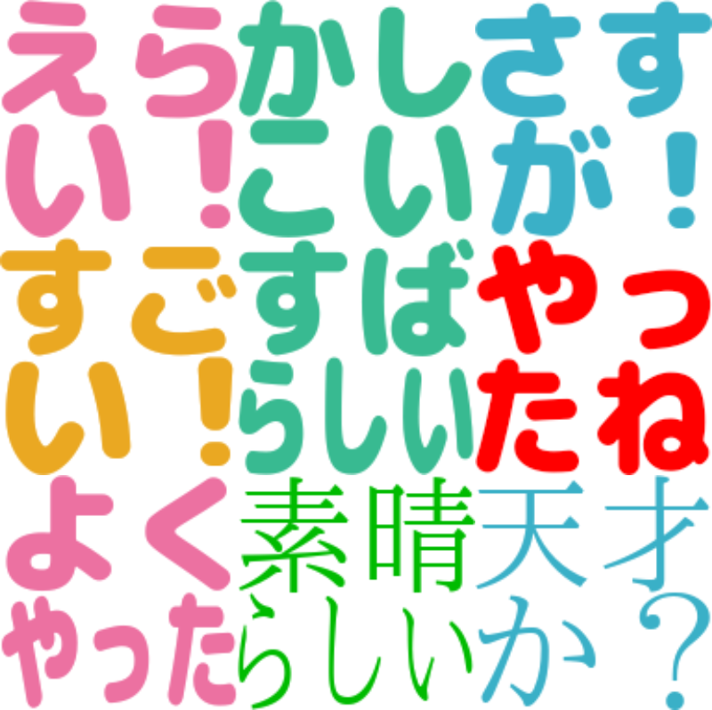

# 全肯定絵文字セット
**「コミュニケーションに足りないものは"肯定"である」**をテーマに作成された，Slack 用，肯定的な内容ばっかりの絵文字セットです．

## 導入
以下を参照し，一括導入
https://qiita.com/mash76/items/88f396988278806db816

## 参考
https://github.com/decomoji/decomoji
https://qiita.com/mash76/items/88f396988278806db816

--

この絵文字セットは，[絵文字ジェネレーター](https://emoji-gen.ninja/)を使用して作られました．

Copyright (c) 2021 ryhoh.  
Released under MIT license.